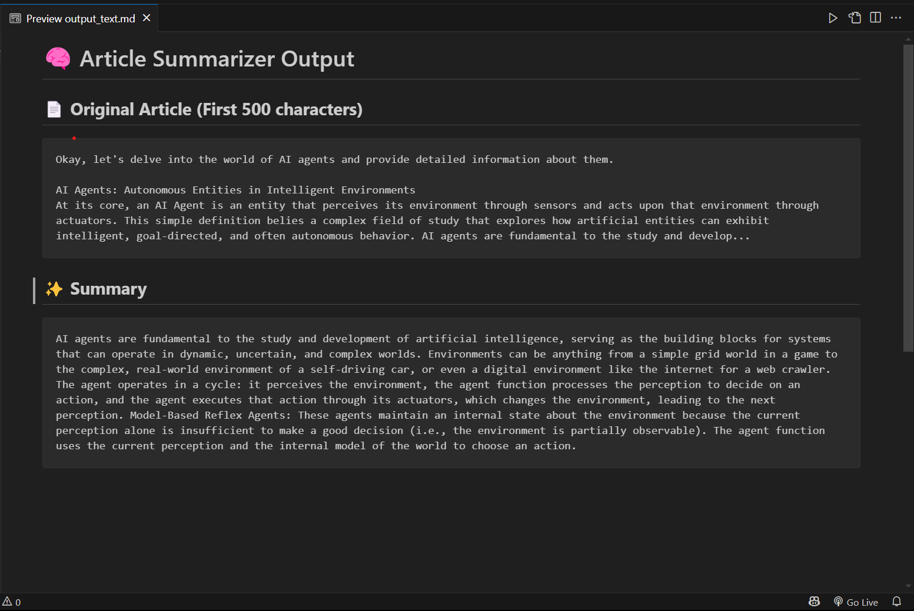

# Internship Details:

***COMPANY:*** CODTECH IT SOLUTIONS  
***NAME:*** RANGDAL PAVANSAI  
***INTERN ID:*** C0DF200  
***DOMAIN:*** Artificial Intelligence Markup Language (AIML Internship)  
***DURATION:*** 4 WEEKS
***MENTOR:*** NEELA SANTHOSH


--- 
# ArticleSummarizer 📚✂️

An elegant Python tool that uses TextRank algorithm to create concise summaries from lengthy articles.


## 🌟 Features

- Summarize long articles into concise, readable summaries
- Extract key sentences using TextRank algorithm
- Generate Markdown output with both original text preview and summary
- Simple and straightforward command-line interface

## 📋 Project Structure

```
ArticleSummarizer/
│
├── CoreCut.py            # Core summarization logic
├── main.py               # Entry point to run the application
├── input_text.txt        # Input article for testing
├── requirements.txt      # Dependencies
├── output_text.md        # Generated output (created when main.py runs)
├── architecture.md       # File architecture documentation
├── LICENSE               # MIT License
└── README.md             # Project overview
```

## 🚀 Installation

1. Clone the repository:

   ```
   git clone https://github.com/Pavansai/ArticleSummarizer.git
   cd ArticleSummarizer
   ```

2. Install dependencies:
   ```
   pip install -r requirements.txt
   ```

## 💻 Usage

1. Place your article text in `input_text.txt`

2. Run the application:

   ```
   python main.py
   ```

3. Find your summarized output in `output_text.md`

## 🔧 Customization

You can modify the number of sentences in your summary by changing the `sentence_count` parameter in `main.py`:

```python
summary = summarize_text(article, sentence_count=5)  # Change 5 to your desired number
```

## 🧠 How It Works

ArticleSummarizer uses the TextRank algorithm from the Sumy library to extract the most important sentences from your text. The algorithm analyzes the relationships between sentences to identify key content, similar to how Google's PageRank works for web pages.

## 📊 Example

**Input:** Your full article text in `input_text.txt`

**Output:** A markdown file containing:

- Preview of the original article (first 500 characters)
- Concise summary with the most important sentences

## Output Image:  
   

## 📦 Dependencies

- NLTK
- Sumy
- Python 3.6+

## 🤝 Contributing

Contributions, issues, and feature requests are welcome! Feel free to check the [issues page](https://github.com/Pavansai20054/TEXT-SUMMARIZATION-TOOL/issues).

## 📝 License

This project is [MIT](LICENSE) licensed.

## 👨‍💻 Author

**Pavansai**

- 📧 Email: pavansai87654321@gmail.com  
- 💼 LinkedIn: https://www.linkedin.com/in/rangdal-pavansai/  
- 🐙 GitHub: https://github.com/Pavansai

